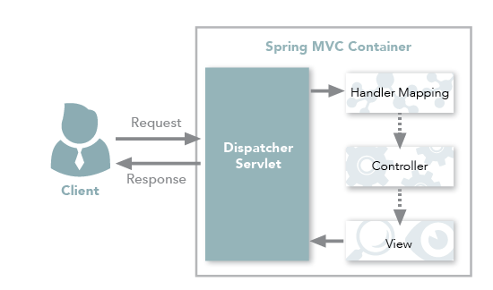
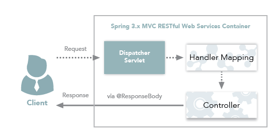
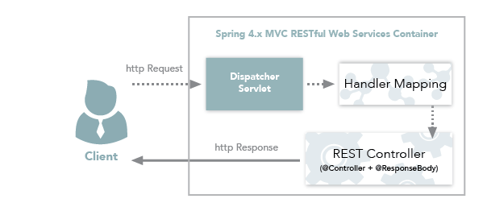

## @Controller
### Controller - View
전통적은 Spring MVC의 컨트롤러인 `@Controller`는 주로 **View를 반환하기 위해 사용**합니다.  
아래와 같은 과정을 통해 Spring MVC Container는 Client의 요청으로 View를 반환합니다.

> @Controller가 View를 반환하기 위해서는 ViewResolver가 사용되며, 설정에 맞게 View를 찾아 렌더링 합니다.

### Controller - Data
Spring MVC의 컨트롤러에서도 **Data를 반환해야 하는 경우**도 있습니다.  
Spring MVC의 컨트롤러에서는 데이터를 반환하기 위해 `@ResponseBody` 어노테이션을 활용해주어야 합니다.  
이를 통해 Controller도 Json 형태로 데이터를 반환할 수 있습니다.

`@RestController`가 Data를 반환하기 위해서는 `viewResolver` 대신에 `HttpMessageConverter`가 동작합니다.  
`HttpMessageConverter`에는 여러 `Converter`가 등록되어있고, 반환해야 하는 데이터에 따라 사용되는 `Converter`가 달라집니다.  
단순 문자열인 경우에는 `StringHttpMessageConverter`가 사용되고, 객체인 경우에는 `MappingJackson2HttpMessageConverter`가 사용되며, 데이터 종류에 따라 서로 다른 `MessageConverter`가 작동하게 됩니다.  
Spring은 클라이언트의 HTTP Accept 헤더와 서버의 컨트롤러 반환 타입 정보 둘을 조합해 적합한 `HttpMessageConverter`를 선택하여 이를 처리합니다.

## RestController
`@RestController`는 Spring MVC Controller에 `@ResponseBody`가 추가된 것 입니다. 
`@RestController`의 주 용도는 Json형태로 객체 데이터를 반환하는 것 입니다.  

## 정리
예전에 프로그래밍을 할 때에는 jsp나 html과 같은 뷰를 전달해주는 방식이였기 때문에 `@Controller`를 사용해왔다.  
최근에는 프론트엔드와 백엔드를 따로 두고 백엔드에서는 REST API를 통해 json으로 데이터만 전달하기 때문에 편리성을 위해 `@RestController`를 사용하게 되었다.