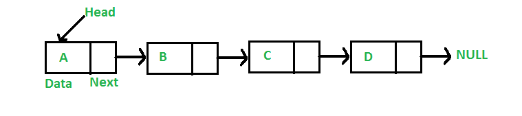

# 배열(Array)과 리스트(List)의 차이

## 배열(Array)

### 배열의 특징
- 같은 자료형을 가진 변수를 하나로 나타낸 것. ` ex) int[] arr = new int[]`
- 연속된 메모리 공간으로 이루어져 있는 것.
- 정적 표현.
- 인덱스를 이용하여 표현. `ex) arr[1]`
- 지역성을 가지고 있다.

### 배열의 장점
1. 인덱스를 통한 검색이 용이함.
2. 연속적이므로 메모리 관리가 편한다.

### 배열의 단점
1. 한 데이터를 삭제하더라도 배열은 연속해야 하므로 공간이 남는다. (메모리 낭비)
2. 정적이므로 배열의 크기를 컴파일 이전에 정해주어야 한다.
3. 컴파일 이후 배열의 크기를 변동 할 수 없다.

## 리스트

### 리스트의 특징
- 순서가 있는 데이터 집합.
- 불연속적으로 메모리 공간을 차지.
- 동적 표현.
- 인덱스가 없음.
- 포인터를 통한 접근.

### 리스트의 장점
1. 포인터를 통하여 다음 데이터의 위치를 가르키고 있어 삽입 삭제의 용이.
2. 동적이므로 크기가 정해져 있지 않다.
3. 메모리 재사용의 편리.
4. 불연속적이므로 메모리 관리의 편리.

### 리스트의 단점
1. 검색 성능이 좋지 않다.
2. 포인터를 통해 다음 데이터를 가르키므로 추가적인 메모리 공간 발생.

## 🥕 정리

Array | 배열 
- 데이터의 크기가 정해져 있고, 추가적인 삽입/삭제가 일어나지 않으며 검색에서 유리.
- ex)`int num[4]` 라고 지정하면 주소값 + 4byte 형식으로 메모리가 연속적으로 잡힌다.

List | 리스트: 
- 데이터의 크기가 정해져 있지 않고, 삽입/삭제가 많이 일어나며, 검색이 적은 경우 유리.
- 리스트는 주소가 연속적이지 않아 크기를 예측할 수 없고, 그만큼 소요시간이 든다.

